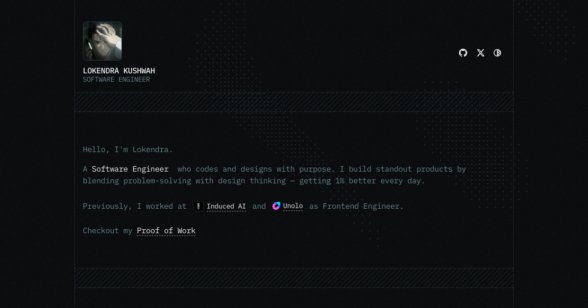

# Anas Farooq - Portfolio



## 🚀 About Me

Hi, I'm **Anas Farooq** — a **Software Engineer** who builds scalable, high-impact digital products. I work across frontend, backend, and mobile, checking out AI-driven solutions to solve real-world problems. With a strong interest in fintech, I combine engineering precision with design thinking to create smart, user-focused systems — getting 1% better every day.

🌐 **Live Site:** [anasfarooq.com](https://anasfarooq.com)

---

## �️ Tech Stack

This portfolio is built with the latest web technologies, focusing on performance, accessibility, and modern design patterns.

-   **Framework:** [Next.js 15 (App Router)](https://nextjs.org/)
-   **Language:** [TypeScript](https://www.typescriptlang.org/)
-   **Styling:** [Tailwind CSS 4](https://tailwindcss.com/)
-   **Animations:** [Motion](https://motion.dev/) & [Three.js](https://threejs.org/)
-   **Content:** [MDX](https://mdxjs.com/)
-   **Analytics:** [PostHog](https://posthog.com/), [Umami](https://umami.is/), [Microsoft Clarity](https://clarity.microsoft.com/)
-   **Linting:** ESLint & Prettier

---

## ⚡ Features

-   **Modern Design:** Clean, minimalist UI with dark mode support.
-   **Interactive:** Smooth animations and transitions using Motion and Three.js.
-   **Responsive:** Fully optimized for all devices.
-   **SEO Optimized:** Meta tags, Open Graph, and JSON-LD support.
-   **Analytics Integrated:** Tracking user engagement with privacy-focused analytics.

---

## 🏃‍♂️ Getting Started

To run this project locally, follow these steps:

### 1. Clone the repository

```bash
git clone https://github.com/anasfarock/my-portfolio-website.git
cd my-portfolio-website
```

### 2. Install dependencies

```bash
npm install
# or
yarn install
# or
pnpm install
```

### 3. Run the development server

```bash
npm run dev
```

Open [http://localhost:3000](http://localhost:3000) with your browser to see the result.

---

## 📂 Scripts

| Script      | Description                                       |
| :---------- | :------------------------------------------------ |
| `npm run dev` | Starts the development server with Turbopack.     |
| `npm run build` | Builds the application for production.            |
| `npm run start` | Starts the production server.                     |
| `npm run lint`  | Runs ESLint to identify and fix code issues.      |

---

## 📫 Connect

-   **Email:** [contact@anasfarooq.com](mailto:contact@anasfarooq.com)
-   **GitHub:** [@anasfarock](https://github.com/anasfarock)
-   **Twitter:** [@AnasFarq](https://twitter.com/AnasFarq)
-   **LinkedIn:** [Anas Farooq](https://linkedin.com/in/anasfarock)

---

Made with ❤️ by Anas Farooq.
